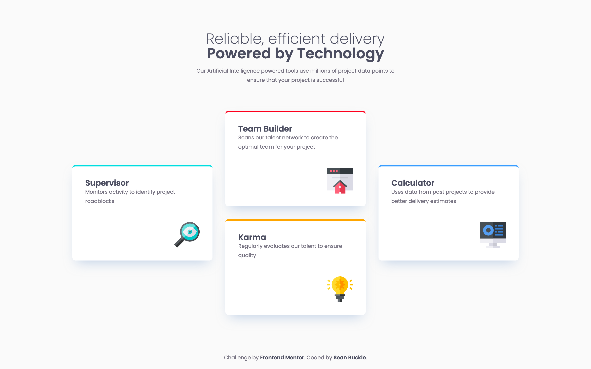

# Frontend Mentor - Four card feature section solution

This is a solution to the [Four card feature section challenge on Frontend Mentor](https://www.frontendmentor.io/challenges/four-card-feature-section-weK1eFYK). Frontend Mentor challenges help you improve your coding skills by building realistic projects. 

## Table of contents

- [Overview](#overview)
  - [The challenge](#the-challenge)
  - [Screenshot](#screenshot)
  - [Links](#links)
- [My process](#my-process)
  - [Built with](#built-with)
- [Author](#author)

## Overview

### The challenge

Users should be able to:

- View the optimal layout for the site depending on their device's screen size

### Screenshot

### Links

- Solution URL: [https://github.com/seanbuckle/four-card-feature-section](https://github.com/seanbuckle/four-card-feature-section)
- Live Site URL: [https://seanbuckle.github.io/four-card-feature-section/](https://seanbuckle.github.io/four-card-feature-section/)

## My process

### Built with

- [Semantic HTML5 markup](https://developer.mozilla.org/en-US/docs/Web/HTML)
- [CSS custom properties](https://developer.mozilla.org/en-US/docs/Web/CSS/Using_CSS_custom_properties)
- [Flexbox](https://developer.mozilla.org/en-US/docs/Web/CSS/flex)
- [CSS Grid](https://developer.mozilla.org/en-US/docs/Web/CSS/grid)
- [Mobile-first workflow](https://developer.mozilla.org/en-US/docs/Web/CSS/Media_Queries/Using_media_queries)
- [Google Fonts](https://fonts.google.com/)
- [SASS/SCSS](https://sass-lang.com/)
- [BEM](http://getbem.com/)

## Author
- Frontend Mentor - [@seanbuckle](https://www.frontendmentor.io/profile/seanbuckle)
- X - [@seanlbuckle](https://www.twitter.com/seanlbuckle)
- LinkedIn - [@seanbuckle](https://www.linkedin.com/in/seanbuckle/)